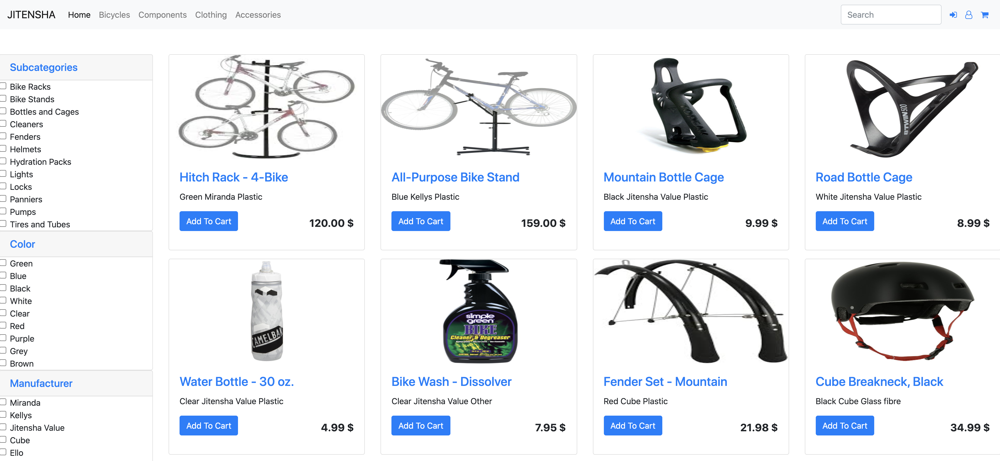

# Jitensha - a bicycle shop made using the Play framework

## What and why?

This is a project developed for a course "E-Business Concept and Technologies" in Wrocław University of Science and Technology. 

The task given to us was to develop a store where people would be able to purchase something. We chose to promote healthier lifestyle by creating a bicycle store. 

We used the Play Framework to develop the website, PostgreSQL as our database and Stripe to process payments.
The site is accessible [here](https://pure-taiga-38770.herokuapp.com/).

## The Team

- Dominik Kaszewski
- Ivan Redchuk
- Oleksii Kyrylchuk

## Screenshots

 
Home page

 
The store, all items can be filtered and the products are also paginated

